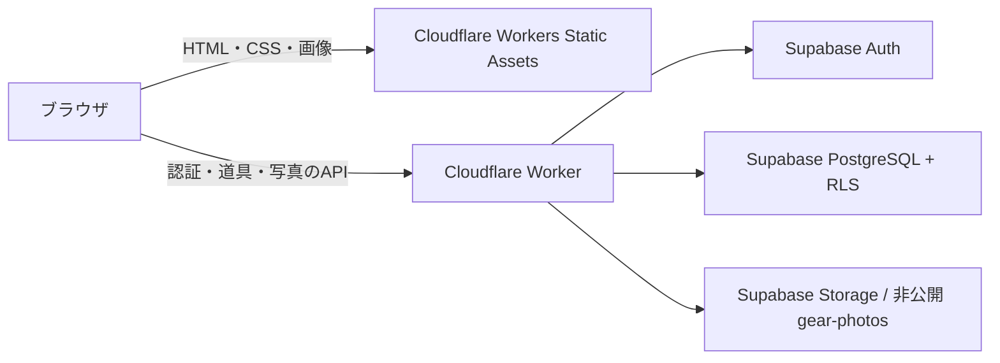

# キャンプギア棚 v8 のアーキテクチャ

JavaScript ES modulesとクラスで構成する。既存の布・木・紙札の画面を維持し、画面、業務処理、保存先を分離した。ビルド時に公式Supabase SDKの固定版を同梱する。

## 配置

通常はCloudflareの同一ドメインから画面とAPIを提供する。静的ファイルはStatic Assetsで配信し、`/api/*` と `/app-config.js` だけWorkerを先に実行する。ブラウザからSupabaseへ道具・写真を直接送信しない。Google認証の画面とOAuthコールバックはGoogleおよびSupabaseが処理する。

Workerは公開キーと利用者のJWTをSupabaseへ渡す。管理用の `service_role` / `sb_secret_` キーを実行環境に持たせない。公開キーはブラウザにも渡す値であり、権限の境界には使わない。権限はAuthのJWTとDB・StorageのRLSで決める。

## クラスと責務

| 層       | ファイル / クラス                                     | 責務                                                 |
| -------- | ----------------------------------------------------- | ---------------------------------------------------- |
| 起動     | `src/application/Bootstrap.js`                        | 保存先の選択、認証イベント、ユーザー切替、依存注入   |
| ドメイン | `Gear` / `GearShelf`                                  | 道具の型・入力の正規化、荷物の選択、道具の追加・削除 |
| 業務処理 | `ShelfService`                                        | 更新の直列化、競合、写真差し替え、確定状態の管理     |
| 移行     | `LegacyMigrationService`                              | 本人が選んだ旧ブラウザデータを空のクラウド棚へ移す   |
| 画面     | `AppController` / `NavigationController`              | 共通イベント、画面切替、戻る位置、保存表示           |
| 画面     | `StorageSceneView` / `CollectionView`                 | 収納・一覧・荷物・状態確認の描画                     |
| 画面     | `GearDetailView` / `GearMaintenanceView` / `AuthView` | 詳細、作業台、ログイン                               |
| 保存     | `LocalShelfRepository` / `CloudShelfRepository`       | 同じ契約でブラウザ保存とDB保存を差し替える           |
| 写真     | `LocalPhotoRepository` / `CloudPhotoRepository`       | IndexedDBと非公開Storageを差し替える                 |
| 通信     | `ApiClient` / `SupabaseAuthService`                   | ユーザーJWT付きAPI通信、公式SDKによる認証            |
| 入口API  | `worker/index.js` / `ClientOrigins`                   | ルーティング、データ容量上限、許可した接続元         |
| API処理  | `ShelfApi` / `PhotoApi` / `AuthProxy`                 | 道具、非公開写真、限定された認証経路                 |
| 上流通信 | `SupabaseGateway`                                     | Supabase通信とエラーの変換                           |

保存先の契約は `src/application/ports.js` にJSDocで記載した。画面からlocalStorageやSQLを操作せず、`ShelfService` に依頼する。1ファイルに1つの主要クラスを置き、公開メソッド名で担当する操作を表す。

## 認証とユーザー切替

Googleログインを標準にする。OAuthはPKCEを使い、パスワードの保存・照合をアプリで実装しない。セッションは公式SDKがブラウザに保持し、自動更新する。ログアウトするとSDKのセッション、描画済みの道具、写真のblob URL、編集途中のデータを消す。

通常のメール認証は初期状態で無効。メール認証を有効にする場合は、Supabaseで送信先制限のないSMTPを設定してから `ENABLE_EMAIL_AUTH=true` に変更する。メール登録、ログイン、パスワード変更の画面とAPI経路は実装済み。

新しいアカウントの棚は空で始まる。サンプルや所有ペグを自動的にクラウドへ入れない。ローカルモードは従来データを維持するために残している。Cloudflare配信時はWorkerが設定をクラウドモードへ置き換える。

## DBと保存の単位

| テーブル          | 主キー             | 内容                                                     |
| ----------------- | ------------------ | -------------------------------------------------------- |
| `camp_shelves`    | `user_id`          | テーマ、キャンプ名、更新番号                             |
| `camp_gear`       | `user_id, id`      | 名前、写真の保存パス、数量、重量、状態、お手入れ工程など |
| `camp_trip_items` | `user_id, gear_id` | 今回持っていく道具。道具への外部キー付き                 |

すべて本人の `auth.uid()` と `user_id` が一致する行だけ操作できる。未ログインのロールには権限を与えない。SQLは `supabase/migrations/202610060001_camp_shelf.sql` にまとめてある。

`camp_save_shelf` は棚の更新番号をロックして比較し、道具と今回の荷物を同じトランザクションで保存する。古い端末からの保存は409相当の競合として止める。画面には保存成功後の状態だけを反映する。競合時の「棚を読み直す」は、未保存入力を戻すことを確認してから最新状態を取得する。

画面では操作をキューに入れる。キャンプ名の入力は500msまとめて保存する。リアルタイム同期は使わず、ログイン時と利用者が読み直した時に最新の棚を取得する。

## 写真

写真をブラウザで縮小・WebP圧縮し、透過部分を保持する。保存先は非公開バケット `gear-photos` の `ユーザーID/道具ID/ランダムID.ext`。DBには公開URLではなく保存パスを記録する。

アップロード → 道具情報の確定 → 元の写真の削除、の順で差し替える。保存失敗後の新しい写真は、DBが参照していないことを確認できた時だけ削除する。通信切断で確定状態が不明な場合は写真を残すため、Storageに未参照のファイルが残る可能性がある。容量を整理する時はDBの `photo_path` と突き合わせる。

取得はCloudflareへJWT付きで要求し、画面では短命のblob URLを使う。写真を公開バケットや共有キャッシュへ入れない。同梱の背景・透過ペグ画像は公開静的素材として `assets/` から配信する。

## API

| メソッド / パス             | 内容                                               |
| --------------------------- | -------------------------------------------------- |
| `GET /api/config`           | 認証SDKの接続先、公開キー、メール認証の有効状態    |
| `GET /api/shelf`            | 本人の棚を読む                                     |
| `PUT /api/shelf`            | 本人の棚と更新番号を渡して保存（上限1MiB）         |
| `POST /api/photos`          | 写真を追加（上限5MiB、PNG・WebP・JPEG）            |
| `GET /api/photos/{path}`    | 本人の非公開写真を取得                             |
| `DELETE /api/photos/{path}` | 本人の写真を削除                                   |
| `/api/supabase/auth/v1/*`   | SDKが使用する限定された認証操作。管理APIは通さない |

全APIは `no-store` で応答する。認証情報や上流の詳細をログへ出さない。旧サイトからの移行時は `ALLOWED_ORIGINS` に明示したHTTPSの接続元だけ追加で許可できる。CORSはアクセス権限の代わりには使わない。

## 無料枠と今回の確認範囲

2026-10-06に公式資料で確認した構成。独自ドメインを購入せず `workers.dev` を使い、Cloudflare Workers FreeとSupabase Freeを選ぶ。

| サービス                 | 無料枠の主な条件                                                 |
| ------------------------ | ---------------------------------------------------------------- |
| Cloudflare Static Assets | 静的リクエストは無料・無制限。20,000ファイル、1ファイル25MiBまで |
| Cloudflare Worker        | 100,000リクエスト/日、CPU時間10ms/リクエスト                     |
| Supabase DB              | 500MB / プロジェクト                                             |
| Supabase Storage         | 1GBの保存容量。通常のデータ転送枠は5GB                           |
| Supabase Auth            | 50,000 MAU。Google OAuthを利用                                   |

無料枠を超えても無料で無制限に使える構成ではない。Supabase Freeは非活動が続くと一時停止されることがある。Supabaseの画像変換は使わず、ブラウザで圧縮する。

公式資料：[Supabase料金](https://supabase.com/pricing)、[Cloudflare制限](https://developers.cloudflare.com/workers/platform/limits/)、[Static Assets料金](https://developers.cloudflare.com/workers/static-assets/billing-and-limitations/)、[Supabase SMTP](https://supabase.com/docs/guides/auth/auth-smtp)、[RLS](https://supabase.com/docs/guides/database/postgres/row-level-security)、[Storageの権限](https://supabase.com/docs/guides/storage/security/access-control)。

今回の確認は構文、import、HTMLの参照、公開ファイル生成、Workerのビルドまで。ユーザー指定により、画面の操作、スマホ表示、実際の認証・DB保存のテストは行っていない。外部アカウント設定とSQL適用は別途必要。
